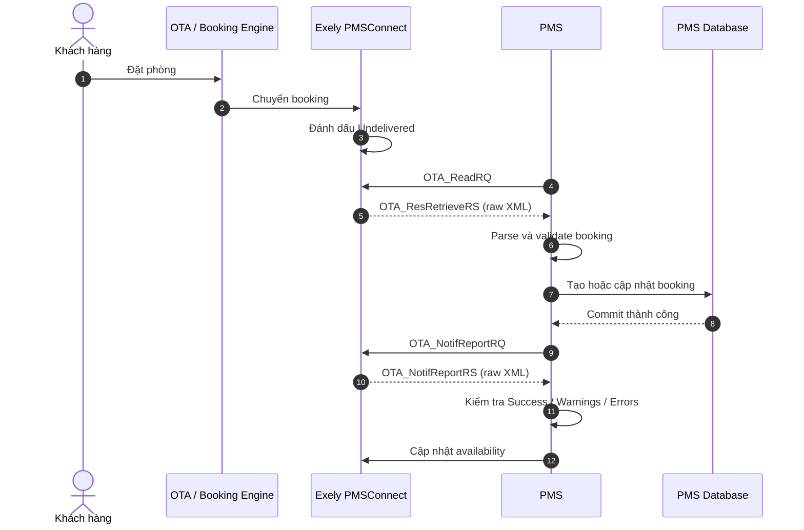

# Exely PMSConnect 1.18 Integration

Tích hợp hệ thống quản lý khách sạn **PMS** với **Exely PMSConnect 1.18** để nhận booking từ OTA và xác nhận kết quả xử lý booking.

> [!IMPORTANT]
> Client chỉ gửi SOAP request và trả về **nguyên văn response body** của Exely. Client không tự parse `Success`, `Warnings`, `Errors`, booking hoặc SOAP Fault. Tầng nghiệp vụ của PMS phải tự xử lý XML nhận được.

## Mục lục

- [Chức năng](#chức-năng)
- [Luồng tích hợp](#luồng-tích-hợp)
- [Cấu trúc dự án](#cấu-trúc-dự-án)
- [Cấu hình](#cấu-hình)
- [Lấy booking chưa xử lý](#lấy-booking-chưa-xử-lý)
- [Xác nhận booking](#xác-nhận-booking)
- [Xử lý raw response](#xử-lý-raw-response)
- [Tích hợp vào hệ thống PMS](#tích-hợp-vào-hệ-thống-pms)
- [Booking modification và cancellation](#booking-modification-và-cancellation)
- [Availability](#availability)
- [Retry, logging và bảo mật](#retry-logging-và-bảo-mật)
- [Checklist production](#checklist-production)

## Chức năng

Dự án chỉ cung cấp hai API công khai:

| Hàm | Chức năng | Giá trị trả về |
| --- | --- | --- |
| `GetUndeliveredBookingsAsync` | Lấy các booking chưa được PMS xác nhận | Raw SOAP XML của `OTA_ResRetrieveRS` |
| `ConfirmBookingAsync` | Xác nhận booking đã được tạo thành công trong PMS | Raw SOAP XML của `OTA_NotifReportRS` |

Không có mock server, fake response hoặc model deserialize trong client.

## Luồng tích hợp

PMS không gọi trực tiếp Booking.com, Agoda hoặc Expedia. PMS giao tiếp với Exely; Exely là lớp trung gian giữa PMS và các OTA.



Luồng rút gọn:

```text
Khách đặt phòng trên OTA
  → OTA gửi booking sang Exely
  → PMS lấy booking bằng OTA_ReadRQ
  → PMS lưu booking vào database
  → PMS xác nhận bằng OTA_NotifReportRQ
  → Exely trả OTA_NotifReportRS
  → PMS cập nhật availability
```

> [!WARNING]
> Chỉ gửi xác nhận sau khi transaction tạo hoặc cập nhật booking trong PMS đã commit thành công.

## Cấu trúc dự án

```text
ExelyPmsConnectDemo/
├── ExelyPmsConnectDemo.csproj
├── Program.cs
└── README.md
```

Toàn bộ mã C# nằm trong [`Program.cs`](./Program.cs).

Yêu cầu:

- .NET 8 SDK
- Endpoint PMSConnect do Exely cung cấp
- Username, password và hotel code hợp lệ

## Cấu hình

Exely cung cấp bốn thông tin kết nối:

| Cấu hình | Ý nghĩa |
| --- | --- |
| `Endpoint` | URL PMSConnect của môi trường test hoặc production |
| `Username` | Tài khoản PMSConnect |
| `Password` | Mật khẩu PMSConnect |
| `HotelCode` | Mã khách sạn trên Exely |

### Cách 1: Dùng biến môi trường

Đây là cách khuyến nghị khi chạy trên server:

```powershell
$env:EXELY_ENDPOINT = "https://ENDPOINT-DO-EXELY-CAP"
$env:EXELY_USERNAME = "USERNAME"
$env:EXELY_PASSWORD = "PASSWORD"
$env:EXELY_HOTEL_CODE = "HOTEL_CODE"
```

### Cách 2: Điền trực tiếp trong mã nguồn

Có thể điền các hằng số ở đầu `Program.cs` khi chạy thử cục bộ.

> [!CAUTION]
> Không commit username hoặc password lên GitHub. Nếu credentials từng được push, hãy đổi mật khẩu/rotate credentials và chuyển chúng sang GitHub Secrets, biến môi trường hoặc secret manager.

## Lấy booking chưa xử lý

### Chạy từ command line

```powershell
dotnet run --project .\ExelyPmsConnectDemo.csproj -- read
```

Nếu không truyền command, chương trình mặc định chạy `read`:

```powershell
dotnet run --project .\ExelyPmsConnectDemo.csproj
```

Console in nguyên response body của Exely, không thêm thông tin khác:

```xml
<s:Envelope xmlns:s="http://schemas.xmlsoap.org/soap/envelope/">
  <s:Body>
    <OTA_ResRetrieveRS
      xmlns="http://www.opentravel.org/OTA/2003/05"
      Version="1.18">
      <Success />
      <ReservationsList>
        <!-- HotelReservation -->
      </ReservationsList>
    </OTA_ResRetrieveRS>
  </s:Body>
</s:Envelope>
```

### Gọi từ C#

```csharp
using var httpClient = new HttpClient
{
    Timeout = TimeSpan.FromSeconds(60)
};

var exely = new ExelyPmsConnectClient(
    httpClient,
    new Uri(endpoint),
    username,
    password);

string rawResponse = await exely.GetUndeliveredBookingsAsync(
    hotelCode,
    cancellationToken);
```

### Các response có thể nhận

| Response | Ý nghĩa |
| --- | --- |
| Có `Success` và `ReservationsList` | Có booking cần PMS xử lý |
| Có `Success`, không có `ReservationsList` | Không có booking mới |
| Có `Warnings/Warning` | Request thành công nhưng có cảnh báo |
| Có `Errors/Error` | Exely từ chối request |
| SOAP Fault | Request SOAP không hợp lệ hoặc dịch vụ gặp lỗi |
| HTTP 4xx/5xx có body | Client vẫn trả nguyên response body |
| DNS, timeout hoặc mất mạng | `HttpClient` ném exception vì không có response body |

## Xác nhận booking

Chỉ xác nhận sau khi booking đã được lưu thành công trong PMS.

### Chạy từ command line

```powershell
dotnet run --project .\ExelyPmsConnectDemo.csproj -- `
  confirm `
  "EXELY_BOOKING_ID" `
  "PMS_CREATE_DATE_TIME" `
  "LAST_MODIFY_DATE_TIME_FROM_READ_RESPONSE" `
  "PMS_BOOKING_ID" `
  "ID_CONTEXT" `
  "111,222"
```

### Danh sách tham số

| Vị trí | Tham số | Bắt buộc | Nguồn dữ liệu |
| ---: | --- | :---: | --- |
| 1 | `EXELY_BOOKING_ID` | Có | `UniqueID@ID` nhận từ Exely |
| 2 | `PMS_CREATE_DATE_TIME` | Có | Thời điểm PMS tạo booking, định dạng XML `dateTime` |
| 3 | `LAST_MODIFY_DATE_TIME` | Có | Copy nguyên văn từ `HotelReservation@LastModifyDateTime` |
| 4 | `PMS_BOOKING_ID` | Có | Mã booking do PMS tạo |
| 5 | `ID_CONTEXT` | Không | `UniqueID@ID_Context` nhận từ Exely |
| 6 | `ROOM_STAYS_CSV` | Không | Các `RoomStay@IndexNumber`, ngăn cách bằng dấu phẩy |

Nếu cần truyền room stay nhưng `ID_CONTEXT` rỗng, truyền chuỗi rỗng ở vị trí thứ năm:

```powershell
dotnet run --project .\ExelyPmsConnectDemo.csproj -- `
  confirm `
  "EXELY_BOOKING_ID" `
  "2026-09-27T10:00:00+07:00" `
  "LAST_MODIFY_DATE_TIME_FROM_RESPONSE" `
  "PMS_BOOKING_ID" `
  "" `
  "111,222"
```

### Gọi từ C#

```csharp
string rawResponse = await exely.ConfirmBookingAsync(
    hotelCode: hotelCode,
    channelBookingId: channelBookingId,
    pmsCreateDateTime: pmsCreateDateTime,
    lastModifyDateTime: lastModifyDateTime,
    pmsBookingId: pmsBookingId,
    idContext: idContext,
    roomStayIndexNumbers: roomStayIndexNumbers,
    cancellationToken: cancellationToken);
```

> [!IMPORTANT]
> `LastModifyDateTime` phải được lưu và gửi lại nguyên văn. Không đổi múi giờ, không format lại và không làm mất phần mili giây.

### Khi nào cần gửi `RoomStay@IndexNumber`?

- Không cần gửi nếu toàn bộ booking Exely tương ứng với một booking duy nhất trong PMS.
- Cần gửi khi một booking Exely được tách thành nhiều booking PMS.
- Cần gửi khi PMS xác nhận riêng từng stay.

Nếu response đọc booking có nhiều `UniqueID`, ưu tiên ID `Type="14"` có `ID_Context` rỗng. Nếu không có, sử dụng ID thuộc context `PMSConnect` theo dữ liệu Exely gửi.

## Xử lý raw response

Việc parse XML nên nằm ở tầng nghiệp vụ, bên ngoài `ExelyPmsConnectClient`.

### Kiểm tra `Success` và `Errors`

```csharp
using System.Xml.Linq;

XNamespace soap = "http://schemas.xmlsoap.org/soap/envelope/";
XNamespace ota = "http://www.opentravel.org/OTA/2003/05";

var document = XDocument.Parse(
    rawResponse,
    LoadOptions.PreserveWhitespace);

var body = document.Root?.Element(soap + "Body");
var otaResponse = body?.Elements().SingleOrDefault();

bool success = otaResponse?.Element(ota + "Success") is not null;

var errors = otaResponse?
    .Element(ota + "Errors")?
    .Elements(ota + "Error")
    .Select(error => new
    {
        Code = (string?)error.Attribute("Code"),
        Message = error.Value.Trim()
    })
    .ToArray()
    ?? Array.Empty<object>();
```

### Lấy danh sách booking

```csharp
var reservations = otaResponse?
    .Element(ota + "ReservationsList")?
    .Elements(ota + "HotelReservation")
    .ToArray()
    ?? Array.Empty<XElement>();
```

### Các trường PMS nên đọc

- `HotelReservation@CreateDateTime`
- `HotelReservation@LastModifyDateTime`
- `HotelReservation@ResStatus`
- `UniqueID@ID`, `UniqueID@ID_Context`, `UniqueID@Type`
- `RoomStay@IndexNumber`
- Room type, rate plan và ngày lưu trú
- Số lượng người lớn, trẻ em và độ tuổi
- Giá từng ngày, tổng tiền và tiền tệ
- Thông tin khách hàng
- Dịch vụ bổ sung
- Booking channel/nguồn OTA
- Phương thức thanh toán và khoản thanh toán
- Ghi chú và chính sách hủy

## Tích hợp vào hệ thống PMS

### Đăng ký client trong ASP.NET Core

Không tạo `HttpClient` mới cho từng booking. Dùng `IHttpClientFactory`:

```csharp
services.AddHttpClient("ExelyPmsConnect", client =>
{
    client.Timeout = TimeSpan.FromSeconds(60);
});

services.AddSingleton(serviceProvider =>
{
    var factory = serviceProvider.GetRequiredService<IHttpClientFactory>();
    var configuration = serviceProvider.GetRequiredService<IConfiguration>();

    return new ExelyPmsConnectClient(
        factory.CreateClient("ExelyPmsConnect"),
        new Uri(configuration["Exely:Endpoint"]!),
        configuration["Exely:Username"]!,
        configuration["Exely:Password"]!);
});
```

### Scheduler lấy booking

```csharp
while (!stoppingToken.IsCancellationRequested)
{
    string rawResponse = await exely.GetUndeliveredBookingsAsync(
        hotelCode,
        stoppingToken);

    // 1. Parse OTA_ResRetrieveRS.
    // 2. Lưu từng booking trong transaction.
    // 3. Commit transaction.
    // 4. Xác nhận từng booking đã lưu thành công.

    await Task.Delay(
        TimeSpan.FromMinutes(5),
        stoppingToken);
}
```

Tài liệu giới hạn tối đa **30 `OTA_ReadRQ` mỗi khách sạn trong một giờ**. Chu kỳ 5 phút tương đương 12 request/giờ.

### Quy trình xử lý từng booking

1. Lấy `UniqueID` và `LastModifyDateTime` từ XML.
2. Kiểm tra booking/version đã tồn tại chưa.
3. Map room type, rate plan, service và payment method sang mã PMS.
4. Validate ngày ở, khách, giá, tiền tệ và trường bắt buộc.
5. Mở transaction database.
6. Tạo booking mới hoặc cập nhật booking hiện có.
7. Lưu quan hệ giữa Exely booking ID và PMS booking ID.
8. Commit transaction.
9. Gọi `ConfirmBookingAsync`.
10. Parse raw response xác nhận.
11. Chỉ hoàn tất khi có `OTA_NotifReportRS/Success`.
12. Cập nhật availability.

Khóa idempotency khuyến nghị:

```text
HotelCode + Exely UniqueID + LastModifyDateTime
```

Khóa này giúp PMS nhận lại cùng một booking mà không tạo bản ghi trùng.

## Booking modification và cancellation

### Booking modification

Modification có cùng `UniqueID` với booking cũ nhưng có `LastModifyDateTime` mới:

```text
OTA sửa booking
  → Exely đưa version mới vào danh sách Undelivered
  → PMS tìm booking theo UniqueID
  → PMS cập nhật booking
  → PMS xác nhận bằng LastModifyDateTime mới
```

Mỗi version phải được xử lý idempotent và xác nhận riêng.

### Khách hủy booking trên OTA

Exely chuyển trạng thái hủy về PMS trong dữ liệu booking. PMS kiểm tra `ResStatus`, cập nhật trạng thái nội bộ và xác nhận đã xử lý.

### Khách sạn hủy booking từ PMS

Chiều PMS chủ động hủy booking trên Exely sử dụng message `OTA_CancelRQ`. Chức năng này không thuộc hai hàm hiện tại.

## Availability

Thứ tự bắt buộc:

```text
1. Lưu booking trong PMS
2. Gửi OTA_NotifReportRQ
3. Nhận OTA_NotifReportRS/Success
4. Cập nhật availability cho Exely
```

> [!WARNING]
> Không giảm availability trước khi xác nhận booking. Exely đang tạm giữ số phòng cho booking `Undelivered`; cập nhật sớm có thể làm số phòng bị giảm hai lần.

## Retry, logging và bảo mật

- Booking mới phải được xử lý và xác nhận trong vòng 20 phút.
- Không gửi xác nhận nếu transaction PMS thất bại hoặc chưa commit.
- Retry lỗi mạng với exponential backoff và giới hạn số lần thử.
- Nếu gửi xác nhận nhưng mất kết nối trước khi nhận response, đánh dấu trạng thái là chưa rõ ràng và kiểm tra trước khi retry liên tục.
- Ghi log thời gian, SOAPAction, hotel code, HTTP status và correlation ID.
- Không ghi password hoặc SOAP security header vào log.
- Kiểm tra cả HTTP status và `Success/Warnings/Errors` trong XML tại tầng nghiệp vụ.
- Raw XML có thể chứa dữ liệu cá nhân, thông tin lưu trú và thanh toán; phải mã hóa nơi lưu và giới hạn quyền truy cập.
- Thử nghiệm và hoàn tất certification trên môi trường test trước khi chuyển production.

## Checklist production

- [ ] Endpoint, username, password và hotel code lấy từ secret/configuration.
- [ ] Không có credentials trong Git history.
- [ ] Scheduler chạy khoảng 5 phút/lần và không vượt 30 lần đọc/giờ.
- [ ] Có idempotency cho booking mới và modification.
- [ ] `LastModifyDateTime` được giữ nguyên văn.
- [ ] Có mapping room type, rate plan, service và payment method.
- [ ] Chỉ xác nhận sau khi transaction PMS commit.
- [ ] Kiểm tra `OTA_NotifReportRS/Success` trước khi đánh dấu hoàn tất.
- [ ] Availability chỉ được cập nhật sau xác nhận.
- [ ] Có retry/backoff, monitoring và cảnh báo booking gần quá 20 phút.
- [ ] Raw XML và credentials được bảo vệ như dữ liệu nhạy cảm.

## Tài liệu liên quan

- Exely PMSConnect Integration Protocol, phiên bản 1.18
- [OpenTravel Alliance](https://www.opentravel.org/)
